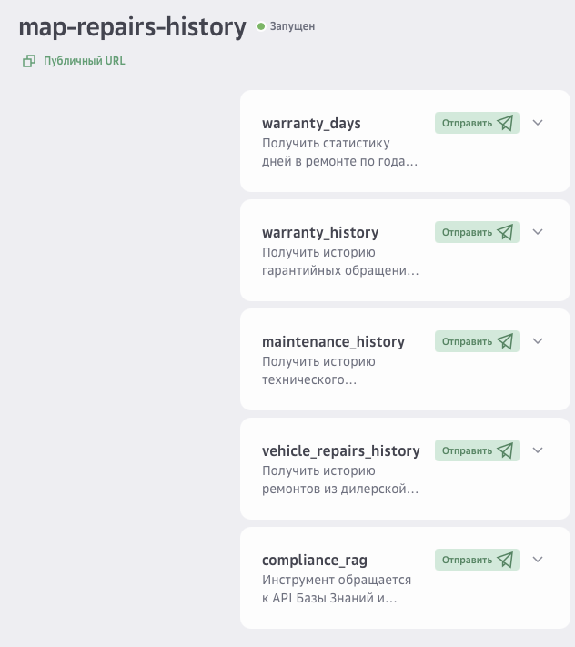
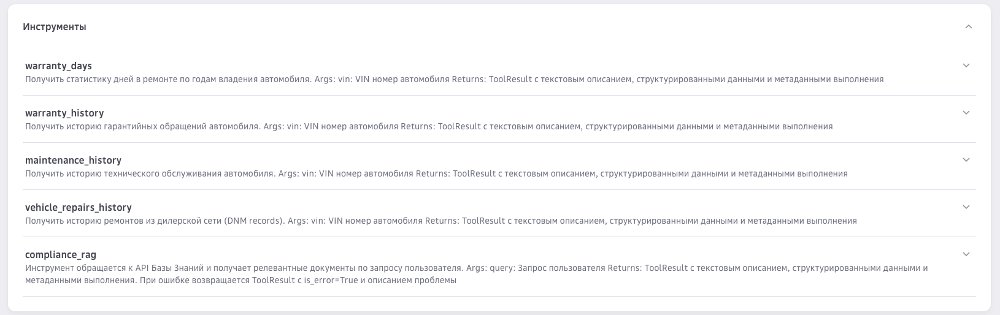
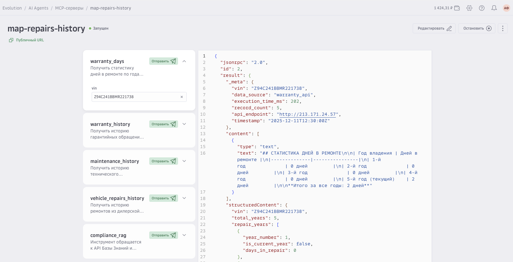
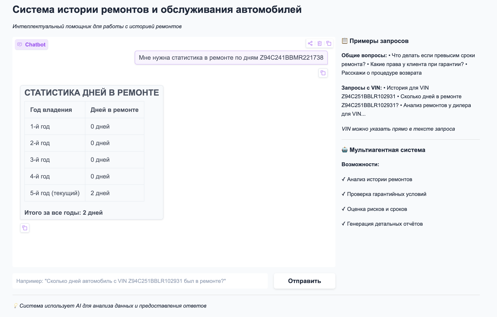
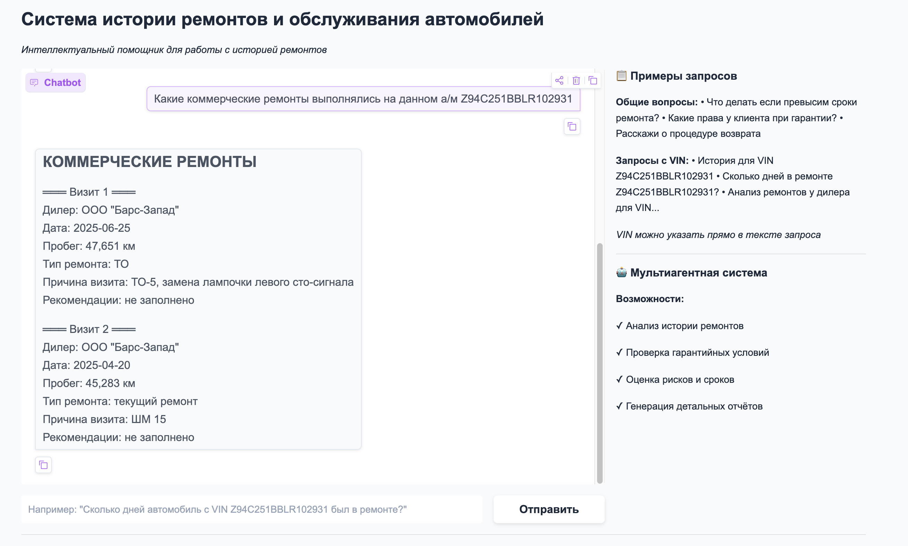
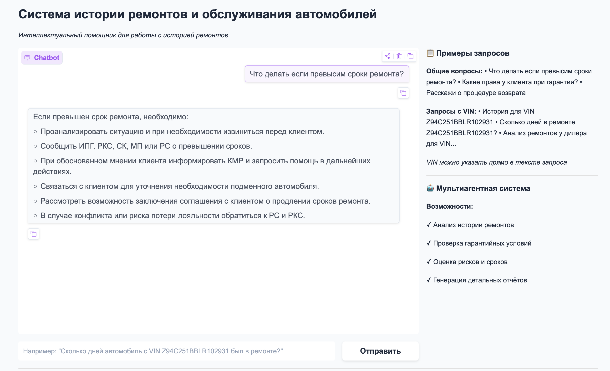
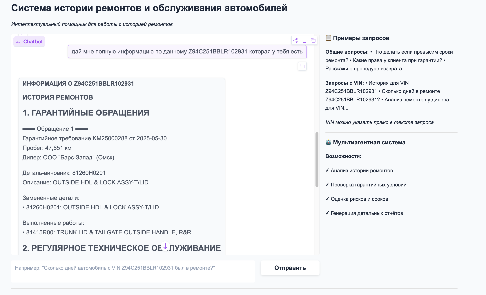

# AutoCompliance MCP

Система для анализа гарантийных обращений и истории ремонтов автомобилей с использованием Model Context Protocol (MCP) и мультиагентной архитектуры на базе LangGraph.

**🐳 Docker & Deployment:** [infra/DOCKER.md](infra/DOCKER.md)

## Компоненты системы

### 🔧 MCP Сервер
MCP сервер предоставляет инструменты для получения данных об истории ремонтов, гарантийных обращений, технического обслуживания автомобилей и стандартах и процедурах гарантийного обслуживания и клиентской службы.

**Документация:** [backend/mcp_server/README.md](backend/mcp_server/README.md)

### 🤖 Система агентов
Мультиагентная система для анализа данных с использованием LangGraph и GigaChat LLM.

**Документация:** [backend/agent/README.md](backend/agent/README.md)

### 🖥️ Frontend (Gradio)
Веб-интерфейс на базе Gradio для взаимодействия с системой агентов через чат-интерфейс.

**Документация:** [frontend/README.md](frontend/README.md)

## Возможности деплоя

### 🚀 Развертывание через Artifact Registry

MCP сервер поддерживает развертывание через Artifact Registry платформы Cloud.ru. Это позволяет использовать MCP сервер как часть инфраструктуры Evolution Platform для создания AI-агентов.

**📚 Подробная документация:** [Создание MCP сервера в Cloud.ru](https://cloud.ru/docs/ai-agents/ug/topics/guides__create-mcp-server?source-platform=Evolution)

### 🧠 Технологии AI/ML

В основе инструментов MCP сервера лежат современные технологии платформы Cloud.ru:

- **Managed RAG** - сервис платформы Cloud.ru для семантического поиска и извлечения информации из базы знаний с использованием векторного поиска и LLM
- **Foundation Models (GigaChat API)** - использование GigaChat через Evolution Platform API (платформа Cloud.ru) для обработки естественного языка и генерации ответов

Эти технологии обеспечивают интеллектуальный анализ гарантийных обращений и истории ремонтов с высокой точностью и контекстным пониманием.

## Быстрый старт

### Локальная разработка

#### 1. Установка зависимостей

```bash
uv sync
```

#### 2. Настройка окружения

Скопируйте файл с примером конфигурации и заполните необходимые параметры:

```bash
cp infra/.env.example infra/.env
```

**📋 Подробное описание всех переменных окружения:** [infra/SECRETS_DESCRIPTION.md](infra/SECRETS_DESCRIPTION.md)


#### 3. Запуск MCP сервера

```bash
cd backend
python -m mcp_server.server
```

Сервер будет доступен на `http://0.0.0.0:8004`

#### 4. Запуск системы агентов

```bash
cd backend
python -m agent.main
```

API будет доступен на `http://localhost:8005`

#### 5. Запуск Frontend (Gradio)

```bash
cd frontend
./run.sh
```

Или напрямую:

```bash
cd frontend
python app.py
```

Frontend будет доступен на `http://0.0.0.0:7860`

**Примечание:** Убедитесь, что система агентов запущена на `http://localhost:8005` перед запуском frontend.

### Production Deployment

Для production развертывания с HTTPS, аутентификацией и nginx reverse proxy:

#### Быстрый старт с Docker Compose

```bash
# 1. Генерация SSL сертификатов (для development)
cd infra/scripts
./generate-certs.sh

# 2. Настройка переменных окружения
cp infra/.env.example infra/.env
# Отредактируйте .env: включите MCP_AUTH_ENABLED и установите MCP_AUTH_TOKEN

# 3. Настройка домена (для production)
# Отредактируйте infra/nginx/conf.d/mcp-server.conf:
# - Замените server_name _; на server_name your-domain.com;
# - Для HTTPS: настройте SSL сертификаты (см. infra/DOCKER.md)

# 4. Запуск
docker-compose --profile full up -d

# 5. Проверка
# Для development (localhost):
curl http://localhost/health
# Для production (замените на ваш домен):
# curl https://your-domain.com/health
```

**Важно для production:**
- Настройте `server_name` в nginx конфигурации на ваш домен
- Используйте реальные SSL сертификаты (Let's Encrypt или корпоративные)
- Настройте DNS записи для вашего домена

**📚 Подробная документация:** [infra/DOCKER.md](infra/DOCKER.md)

### Основные изменения для Production

- ✅ **HTTP Streamable Transport** - современный транспорт вместо устаревшего SSE
- ✅ **Bearer Token Authentication** - защита MCP endpoints
- ✅ **HTTPS/TLS Support** - шифрование трафика
- ✅ **Nginx Reverse Proxy** - rate limiting и дополнительная защита
- ✅ **Docker Compose** - простое развертывание

## Архитектура системы

```
┌─────────────┐
│   Frontend  │  Gradio Web UI (порт 7860)
│   (Gradio)  │
└──────┬──────┘
       │ HTTP POST /agent/query
       ▼
┌─────────────────┐
│  Agent System   │  FastAPI (порт 8005)
│  (LangGraph)    │
└──────┬──────────┘
       │ MCP Protocol
       ▼
┌─────────────────┐
│   MCP Server    │  FastMCP (порт 8004)
│  (Data Access)  │
└─────────────────┘
```

## Документация

- **[Docker & Deployment Guide](infra/DOCKER.md)** - Полная документация по контейнеризации, Docker Compose и production развертыванию
- **[Описание переменных окружения](infra/SECRETS_DESCRIPTION.md)** - Подробное описание всех секретов и переменных конфигурации
- **[MCP Server README](backend/mcp_server/README.md)** - Полная документация по MCP серверу, доступным инструментам и их использованию
- **[Agent System README](backend/agent/README.md)** - Документация по мультиагентной системе, архитектуре и примерам использования
- **[Frontend README](frontend/README.md)** - Документация по Gradio веб-интерфейсу, настройке и использованию

## Использование Frontend

### Примеры запросов

**Общие вопросы (без VIN):**
- "Что делать если превысим сроки ремонта?"
- "Какие права у клиента при гарантии?"
- "Какие контакты клиентской службы?"
- "Какая процедура при повторном ремонте?"

**С указанием VIN:**
- "Сколько дней автомобиль был в ремонте?"
- "История обслуживания автомобиля"
- "Анализ частоты ремонтов у дилера"
- "Покажи все гарантийные обращения"

**📚 Подробная документация по API:** [backend/agent/README.md](backend/agent/README.md)

## Примеры использования

### MCP сервер в Cloud.ru Evolution

Интеграция MCP сервера с платформой Cloud.ru Evolution для создания AI-агентов:



Доступные инструменты MCP сервера:



Пример ответа от MCP сервера при тестировании на платформе Cloud.ru Evolution:



### Frontend интерфейс

#### Анализ статистики дней в ремонте



#### История ремонтов



#### Гарантийная политика и compliance



#### Полный отчет



## Лицензия

См. корневой файл [LICENSE](../../LICENSE).