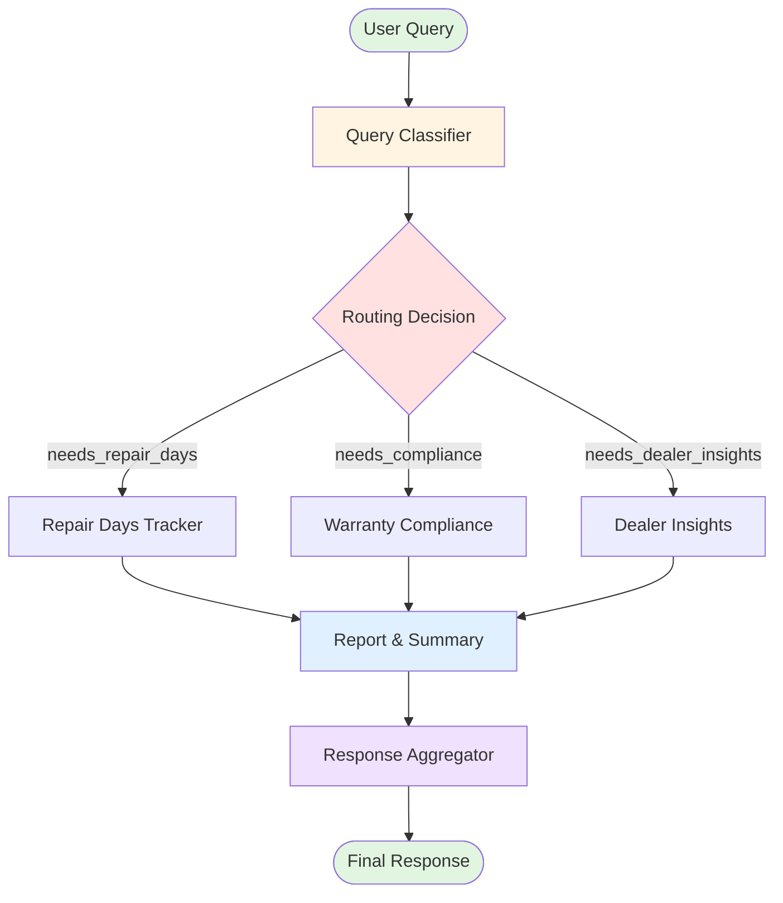
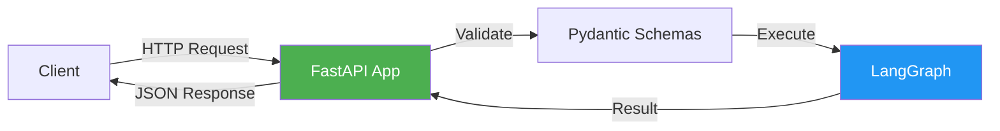
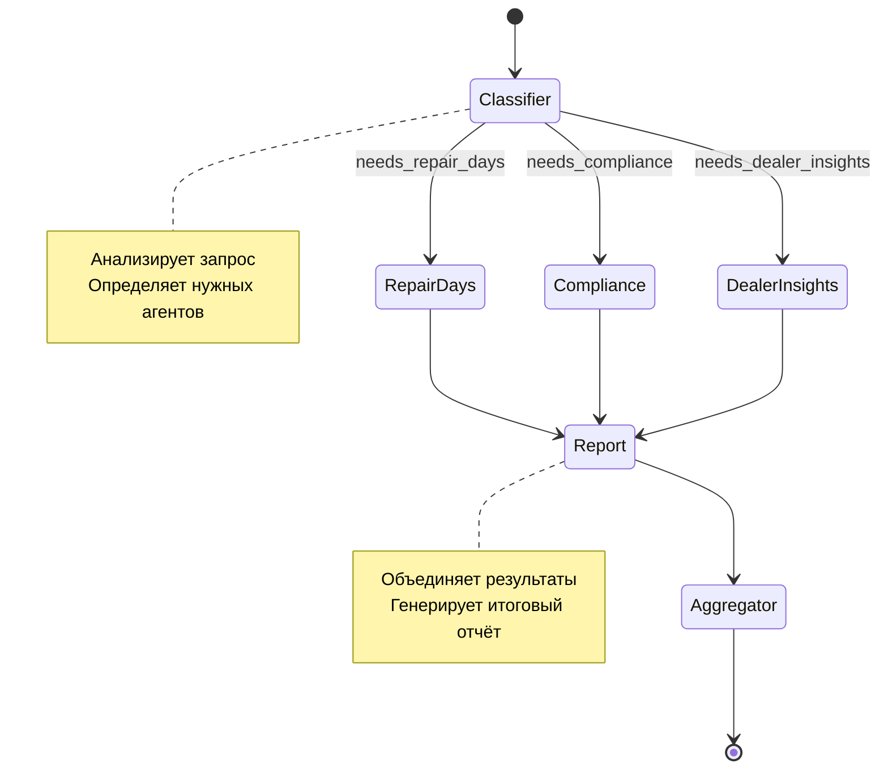
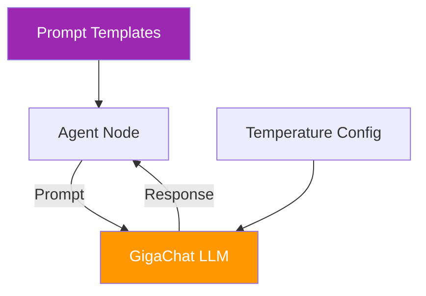
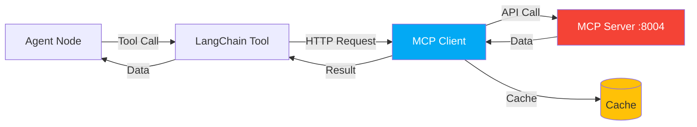
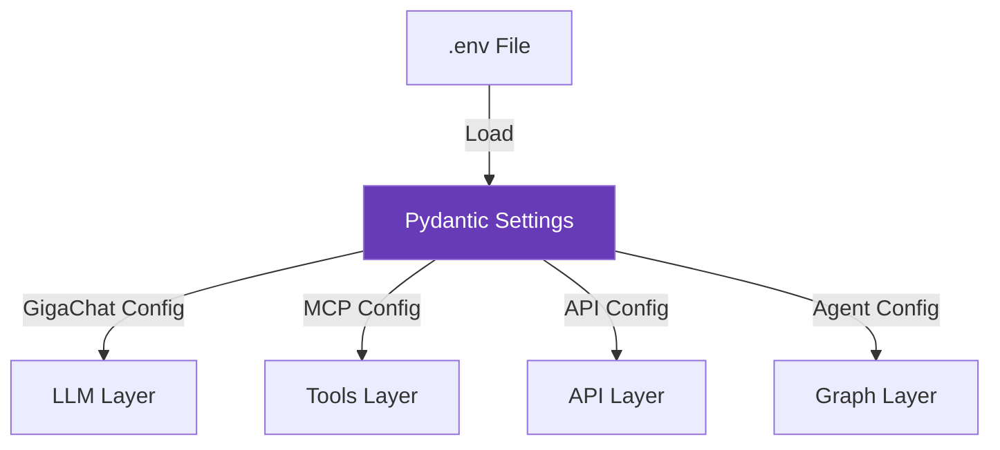
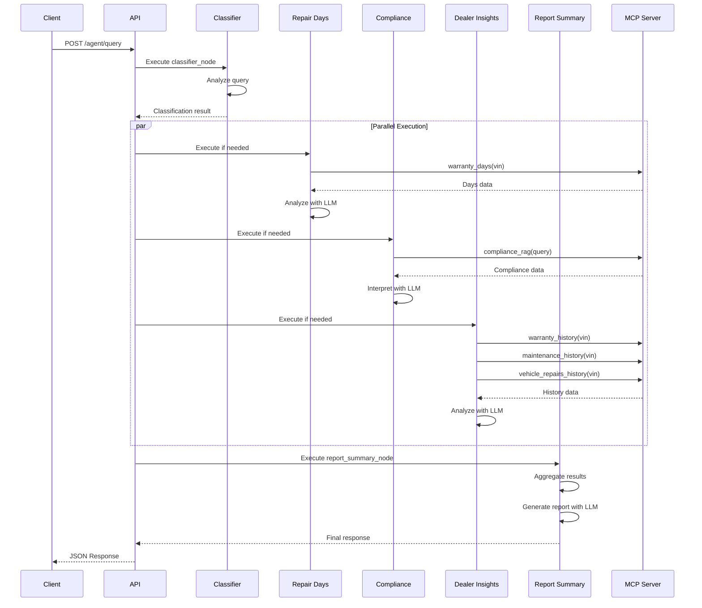
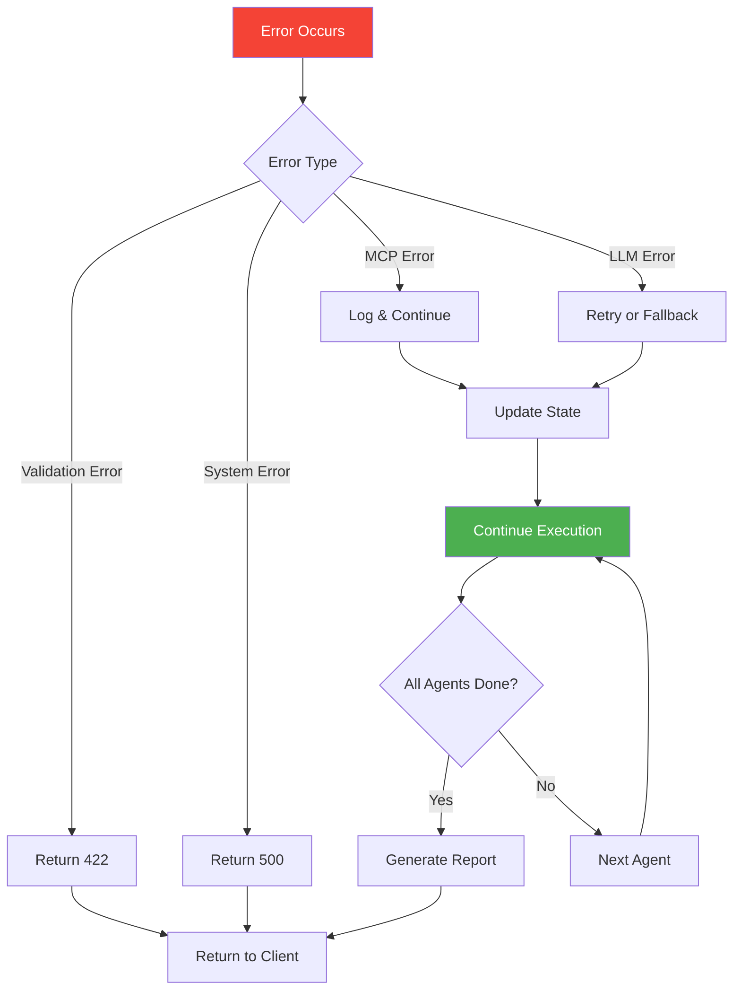
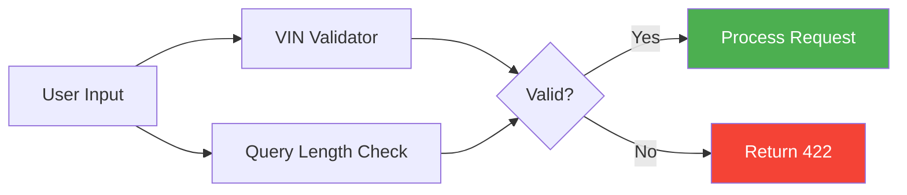

# Архитектура Warranty Agent System

## Обзор системы

Warranty Agent System - это мультиагентная система на базе LangGraph, которая анализирует гарантийные обращения автомобилей, используя GigaChat LLM и MCP (Model Context Protocol) для доступа к данным.

## Граф выполнения (LangGraph Flow)



## Компоненты системы

### 1. API Layer (FastAPI)



**Компоненты:**
- `api/app.py` - FastAPI приложение
- `api/schemas.py` - Pydantic модели для валидации
- Endpoints:
  - `POST /agent/query` - выполнение запроса
  - `GET /health` - проверка здоровья системы
  - `GET /docs` - Swagger документация

### 2. Graph Layer (LangGraph)



**Узлы (Nodes):**

1. **Classifier Node** (`graph/nodes/classifier.py`)
   - Анализирует пользовательский запрос
   - Определяет, какие агенты нужны
   - Извлекает VIN из запроса (если есть)

2. **Repair Days Tracker** (`graph/nodes/repair_days.py`)
   - Получает данные через `warranty_days(vin)`
   - Анализирует дни простоя по годам
   - Проверяет 30-дневный лимит
   - Прогнозирует риски

3. **Warranty Compliance** (`graph/nodes/compliance.py`)
   - Получает данные через `compliance_rag(query)`
   - Интерпретирует гарантийную политику
   - Объясняет права потребителя
   - Ссылается на законодательство

4. **Dealer Insights** (`graph/nodes/dealer_insights.py`)
   - Получает данные через:
     - `warranty_history(vin)`
     - `maintenance_history(vin)`
     - `vehicle_repairs_history(vin)`
   - Анализирует паттерны ремонтов
   - Выявляет повторяющиеся проблемы
   - Оценивает качество работы дилера

5. **Report & Summary** (`graph/nodes/report_summary.py`)
   - Агрегирует результаты всех агентов
   - Генерирует структурированный отчёт
   - Форматирует для пользователя

6. **Response Aggregator** (`graph/nodes/aggregator.py`)
   - Финальная валидация
   - Проверка полноты ответа
   - Добавление метаданных

**State Management:**

```python
class AgentState(BaseModel):
    # Input
    query: str
    vin: Optional[str]
    user_context: dict
    
    # Classification
    classification: Optional[AgentClassification]
    
    # Results
    repair_days_result: Optional[AgentResult]
    compliance_result: Optional[AgentResult]
    dealer_insights_result: Optional[AgentResult]
    
    # Output
    final_response: Optional[str]
    
    # Tracking
    steps_completed: list[str]
    errors: list[str]
```

### 3. LLM Layer (GigaChat)



**Компоненты:**
- `llm/gigachat_setup.py` - инициализация GigaChat
- `llm/prompts.py` - промпты для каждого агента

**LLM конфигурация по агентам:**

| Агент | Temperature | Назначение |
|-------|-------------|------------|
| Classifier | 0.3 | Точная классификация |
| Repair Days | 0.5 | Анализ с умеренной креативностью |
| Compliance | 0.4 | Точная интерпретация законов |
| Dealer Insights | 0.6 | Выявление паттернов |
| Report Summary | 0.5 | Структурированные отчёты |

### 4. Tools Layer (MCP Integration)



**MCP Tools:**

1. `warranty_days(vin)` - статистика дней в ремонте
2. `warranty_history(vin)` - история гарантийных обращений
3. `maintenance_history(vin)` - история ТО
4. `vehicle_repairs_history(vin)` - полная история ремонтов
5. `compliance_rag(query)` - RAG поиск в базе знаний

**Особенности MCP Client:**
- Асинхронное выполнение
- Кэширование результатов (TTL: 5 минут)
- Retry логика (до 3 попыток)
- Обработка ошибок

### 5. Configuration Layer



**Конфигурационные группы:**
- GigaChat (API key, model, temperature)
- MCP Server (URL, timeout, retries)
- Agent (iterations, execution time)
- Application (debug, logging)
- API (host, port, CORS)

## Поток данных

### Типичный запрос (полный цикл)



## Обработка ошибок



**Стратегии обработки:**
1. **MCP ошибки** - логируются, агент продолжает с частичными данными
2. **LLM ошибки** - retry с exponential backoff
3. **Validation ошибки** - немедленный возврат 422
4. **System ошибки** - логирование, возврат 500

## Масштабирование и производительность

### Оптимизации

1. **Параллельное выполнение агентов**
   - LangGraph автоматически запускает независимые узлы параллельно
   - Repair Days, Compliance, Dealer Insights выполняются одновременно

2. **Кэширование**
   - MCP результаты кэшируются на 5 минут
   - LLM инстансы переиспользуются

3. **Асинхронность**
   - Все I/O операции асинхронные
   - Используется asyncio и httpx

### Метрики производительности

| Метрика | Значение |
|---------|----------|
| Средняя задержка (1 агент) | 2-3 сек |
| Средняя задержка (3 агента) | 4-6 сек |
| MCP запрос | 200-500 мс |
| LLM генерация | 1-3 сек |
| Кэш hit rate | ~60-70% |

## Безопасность

### Валидация входных данных



### Меры безопасности

1. **Input Validation**
   - VIN: 17 символов, regex паттерн
   - Query: 3-1000 символов
   - Pydantic схемы для всех входных данных

2. **API Security**
   - CORS настройки
   - Rate limiting (будущее)
   - API ключи (будущее)

3. **Data Privacy**
   - Логи не содержат PII
   - VIN не логируется полностью
   - Кэш очищается по TTL

## Мониторинг и наблюдаемость

### Логирование

```python
# Уровни логирования
DEBUG   # Детальная трассировка
INFO    # Основные события
WARNING # Потенциальные проблемы
ERROR   # Ошибки выполнения
```

### Метрики (собираются в state)

- Execution time
- Steps completed
- Agents used
- Errors count
- Cache hits/misses

### Health Checks

```
GET /health
- API status
- MCP connection status
- LLM availability
```

## Будущие улучшения

1. **Streaming responses** - поддержка SSE для real-time обновлений
2. **Persistent memory** - сохранение истории диалогов
3. **Human-in-the-loop** - запрос подтверждений у пользователя
4. **Multi-modal** - обработка изображений документов
5. **Analytics dashboard** - визуализация метрик
6. **A/B testing** - эксперименты с промптами
